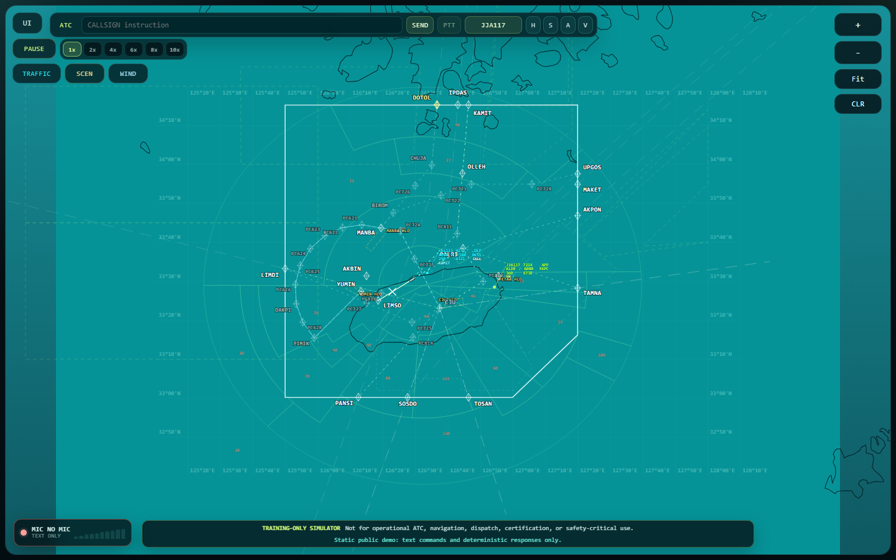

# Jeju Radar Training Simulator

[](https://github.com/ljs51256607-bit/jeju-radar-training-sim/actions/workflows/verify.yml)

Jeju Radar Training Simulator is an open-source browser-based radar training simulator focused on procedure-based ATC training, deterministic scenario replay, coordinate authority validation, and phraseology regression testing.

Jeju/RKPC is the first reference implementation.

This is not an operational ATC system. It is not for real-world air traffic control, navigation, dispatch, certification, or safety-critical decision making.

## Live Demo

Static public demo: [Jeju Radar Training Simulator](https://ljs51256607-bit.github.io/jeju-radar-training-sim/)

The demo is training-only. It does not include operational ATC, navigation, dispatch, certification, safety-critical use, private source material, or API keys.



## Project Status

This repository has a public `v0.1.0` release candidate and an active `v0.1.x` maintenance line.

The current maintainer focus is operational readiness for public OSS work: issue templates, release discipline, scheduled verification, dependency maintenance, and a free-first public demo path.

The public release surface is built from an allowlist, not a wholesale copy of the source workspace. It can build and run core verification without private source files, local secrets, generated artifacts, or oversized data.

## Why This Matters

Radar training often depends on dedicated simulator rooms, instructor scheduling, and another person acting as the pilot. This project explores a web-based training surface that can run on ordinary computers so controllers can rehearse procedures, phraseology, traffic sequencing, and radar decision-making with less scheduling friction.

The long-term direction is to start with Jeju approach training, then generalize toward other Korean approach-control environments and enroute/ACC training. AI pilot role-play is part of that direction: the simulator should let a trainee practice alone while an AI pilot agent handles readbacks and training-only pilot responses.

## What This Project Is For

- Radar-style browser UI for procedure-based training scenarios
- RKPC/Jeju reference data displayed through an explicit coordinate authority policy
- Aircraft state, command handling, route progression, and radar-level motion checks
- DCT, STAR, SID, ILS, missed approach, handoff, visual approach, and traffic-flow rehearsal surfaces
- Deterministic verification for procedures, motion, scenarios, data authority, and phraseology contracts

## What This Project Is Not

- Not an operational ATC system
- Not a navigation source
- Not a certified simulator
- Not a replacement for official AIP, SOP, training manuals, or regulator-approved tools
- Not a repo for redistributing private training material, local SOP PDFs, or secrets

## Repository Layout

```text
jeju-radar-training-sim/
  README.md
  MAINTAINING.md
  SUPPORT.md
  DISCLAIMER.md
  DATA_POLICY.md
  CONTRIBUTING.md
  SECURITY.md
  ROADMAP.md
  OPERATIONS_UPGRADE_PLAN.md
  CHANGELOG.md
  LICENSE
  DATA_LICENSE.md
  data/
    authority/
    geometry/
    reference/
    scenarios/
  docs/
    assets/
      jeju-radar-scope.png
    architecture.md
    data-authority.md
    demo.md
    release-process.md
    triage-policy.md
    verification.md
  jeju-radar-ui/
    index.html
    package.json
    src/
    scripts/
    tsconfig.json
    vite.config.ts
  phraseology_contract/
  scripts/
```

## Expected Local Verification

```powershell
cd jeju-radar-ui
npm ci
npm audit --audit-level=moderate
npm run build
npm run verify:public
```

Coordinate authority verification:

```powershell
powershell -NoProfile -ExecutionPolicy Bypass -File scripts\validate_coordinate_authority.ps1
```

Phraseology contract verification:

```powershell
cd phraseology_contract
powershell -NoProfile -ExecutionPolicy Bypass -File scripts\validate_phraseology_contract.ps1
node scripts\verify-parser.mjs
node scripts\verify-response-policy.mjs
node scripts\verify-voice-tolerance-cases.mjs
```

## Migration Control

Internal migration notes are kept outside the public release surface. The public boundary is defined by this README, [DATA_POLICY.md](DATA_POLICY.md), [DATA_LICENSE.md](DATA_LICENSE.md), [DISCLAIMER.md](DISCLAIMER.md), the public docs under [docs/](docs/), and the verification scripts included in this repository.

## Public Documentation

- [Architecture](docs/architecture.md)
- [Verification](docs/verification.md)
- [Data authority](docs/data-authority.md)
- [Public demo](docs/demo.md)
- [Release process](docs/release-process.md)
- [Triage policy](docs/triage-policy.md)
- [Maintaining](MAINTAINING.md)
- [Support](SUPPORT.md)

## Data Policy

See [DATA_POLICY.md](DATA_POLICY.md).

Repository-authored data and upstream-derived data boundaries are covered separately in [DATA_LICENSE.md](DATA_LICENSE.md). The code is covered by [LICENSE](LICENSE).

The short version:

- Public repo data must be derived, documented, and safe to redistribute.
- Private PDFs, SOPs, training manuals, tacit notes, and local secrets are not included.
- Exact, training, and reference-only geometry must be labeled separately.

## Disclaimer

See [DISCLAIMER.md](DISCLAIMER.md).
